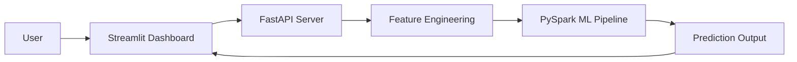

# 🚀 Fraud Detection System — Production-Grade ML Platform

<p align="center">
Detect fraudulent financial transactions in real-time using a scalable ML system built with FastAPI, PySpark, and Streamlit.
</p>

<p align="center">
<b>⚡ Real-Time Inference • 🔥 Scalable ML • 📊 Interactive Dashboard</b>
</p>

---

## 🏆 Badges


---

## 🔥 Live Demo (Product Experience)

🎥 Real-time fraud detection + batch analytics dashboard in action

<p align="center">
  
</p>

---

## 💡 Why This Project Matters

Financial fraud costs billions every year — detecting it in real-time at scale is a real-world engineering challenge.

This project demonstrates how to:

- ⚡ Build real-time fraud detection systems  
- 🔥 Scale ML pipelines using PySpark  
- 🚀 Deploy models via production-ready APIs  
- 📊 Create interactive dashboards for decision-making  

👉 This is not just a model — it's a complete production-style ML system

---

## ⚙️ Tech Stack

| Layer        | Technology            |
|-------------|---------------------|
| Backend     | FastAPI             |
| ML Engine   | PySpark Pipeline    |
| Frontend    | Streamlit           |
| Visualization | Plotly / Matplotlib |
| Deployment  | VM / GCP Ready      |

---

## ✨ Key Features

### ⚡ Real-Time Prediction
- Instant fraud detection via API  
- Low latency inference  

### 📊 Interactive Dashboard
- Single transaction prediction  
- CSV batch processing  
- Visual fraud distribution  

### 🧠 Feature Engineering
- Log transformation of transaction amount  
- Outlier detection  
- Balance difference analysis  
- Behavioral signals  

### 🔥 Scalable ML Pipeline
- PySpark PipelineModel  
- Handles large-scale transaction data  

---

## 🏗️ System Architecture



---

## 📊 Model Performance

| Metric    | Score  |
|----------|--------|
| Accuracy | 99%+   |
| Precision | High  |
| Recall   | High   |
| ROC-AUC  | Strong |

⚠️ Replace these with your real evaluation metrics for maximum impact

---

## 📸 Screenshots

<p align="center">
  <br><br>
  <br><br>
  <br><br>
  <br><br>
  <br><br>
  
</p>

---

## 📂 Project Structure

```
fraud-detection-system/
│
├── app/                    # FastAPI backend
│   └── app.py
│
├── streamlit_app/         # Streamlit frontend
│   └── app.py
│
├── model/                 # Trained Spark model
│   └── fraud_modelss/
│
├── data/
├── screenshots/
│
├── requirements.txt
├── README.md
└── architecture.md
```

---

## 🚀 Getting Started

### 1️⃣ Clone Repository
```bash
git clone https://github.com/your-username/fraud-detection-system.git
cd fraud-detection-system
```

### 2️⃣ Install Dependencies
```bash
pip install -r requirements.txt
```

### 3️⃣ Run FastAPI Server
```bash
uvicorn app.app:app --host 0.0.0.0 --port 8000
```

### 4️⃣ Run Streamlit Dashboard
```bash
streamlit run streamlit_app/app.py
```

---

## ⚡ API Endpoints

| Endpoint   | Method | Description          |
|-----------|--------|----------------------|
| /health   | GET    | Health check         |
| /predict  | POST   | Single prediction    |

---

## 📈 Features Used

- Transaction Amount  
- Transaction Type  
- Balance Differences  
- Destination Account Behavior  
- Outlier Indicators  

---

## 🚀 Future Improvements

- 🔥 Real-time streaming with Kafka  
- 🔥 Explainable AI (feature contribution)  
- 🔥 Docker + CI/CD pipeline  
- 🔥 Cloud deployment with custom domain  
- 🔥 Risk scoring system  

---

## 👨‍💻 Author

**Kiran Kumar**  
Data Science & AI Engineer  

---

## ⭐ Support

If you found this useful:

👉 Star ⭐ the repo  
👉 Share with others  
👉 Connect for collaboration  

---

<p align="center">
Built with 💡 Data + Engineering Precision
</p>
