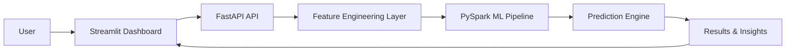

# 🚀 Fraud Detection System — Production-Grade ML Platform

<p align="center">
Detect fraudulent financial transactions at scale using <b>PySpark + FastAPI + Streamlit</b>
</p>

<p align="center">
<b>⚡ Real-Time Inference • 🔥 Big Data Processing • 📊 Interactive Analytics</b>
</p>

---

## 🏆 Badges


---

## 🌐 Live Deployment

| Service | Link |
|--------|------|
| 📊 Streamlit Dashboard | http://34.131.252.227:8501 |
| ⚡ FastAPI Backend | http://34.131.252.227:8000 |
| 📄 API Docs | http://34.131.252.227:8000/docs |
| 🧪 Health Check | http://34.131.252.227:8000/health |

> ⚡ Deployed on a cloud VM with real-time inference capability.

---

## 🔥 Live Demo

<p align="center">
  
</p>

---

## 💡 Why This Project Matters

Financial fraud detection is a high-impact real-world problem:

- Millions of transactions per day  
- Extremely imbalanced data (~0.13% fraud)  
- Need for real-time decision systems  
- Requirement for scalable ML pipelines  

👉 This project demonstrates a **production-grade ML system** (Data → Model → API → UI)

---

## 📊 Dataset Overview

- 📦 Total Records: **6,362,620**  
- 🎯 Fraud Cases: **8,213 (~0.13%)**  
- ⚠️ Highly Imbalanced Dataset  

---

## ⚙️ Tech Stack

| Layer | Technology |
|------|-----------|
| Big Data | PySpark |
| ML Pipeline | Spark ML |
| Backend | FastAPI |
| Frontend | Streamlit |
| Visualization | Plotly |
| Deployment | Cloud VM |

---

## 🧠 ML Pipeline Overview

### ✔ Data Processing
- Schema inference  
- Null & duplicate handling  
- Statistical profiling  

### ✔ Feature Engineering
- Log transformations  
- IQR-based outlier detection  
- Balance difference features  
- Transaction behavior signals  

### ✔ Handling Imbalance
- Undersampling  
- Class-weighted learning  

### ✔ Model Pipeline
- StringIndexer  
- OneHotEncoder  
- VectorAssembler  
- StandardScaler  
- Logistic Regression  

---

## 📈 Model Performance

| Metric | Score |
|--------|------|
| ROC-AUC | **0.9931** |
| Precision | **0.9998** |
| Recall | **0.9378** |

👉 High precision + strong recall → **Reliable fraud detection system**

---

## 🏗️ Architecture



---

## ⚡ API Endpoints

| Endpoint | Method | Description |
|----------|--------|------------|
| /health | GET | Health check |
| /predict | POST | Single prediction |

---

## 📊 Dashboard Preview

<p align="center">
  <br><br>
  <br><br>
  <br><br>
  <br><br>
  
</p>

---

## 📂 Project Structure

```
fraud-detection-system/
│
├── app/                # FastAPI backend
├── streamlit_app/      # Streamlit dashboard
├── model/              # Trained Spark model
├── data/               # Dataset
├── screenshots/        # UI visuals
│
├── requirements.txt
├── README.md
└── architecture.md
```

---

## 🚀 Getting Started

### 1️⃣ Clone Repository
```bash
git clone https://github.com/your-username/fraud-detection-system.git
cd fraud-detection-system
```

### 2️⃣ Install Dependencies
```bash
pip install -r requirements.txt
```

### 3️⃣ Run API
```bash
uvicorn app.app:app --host 0.0.0.0 --port 8000
```

### 4️⃣ Run Dashboard
```bash
streamlit run streamlit_app/app.py
```

---

## 🚀 Future Improvements

- 🔥 Kafka real-time streaming  
- 🔥 Explainable AI (SHAP / LIME)  
- 🔥 Docker + CI/CD pipelines  
- 🔥 Custom domain + HTTPS  

---

## 👨‍💻 Author

**Kiran Kumar**  
Data Science & AI Engineer  

---

## ⭐ Support

If you found this useful:

- ⭐ Star the repository  
- 🔗 Share it  
- 🤝 Connect  

---

<p align="center">
Built with 💡 Big Data + Machine Learning + Engineering
</p>
